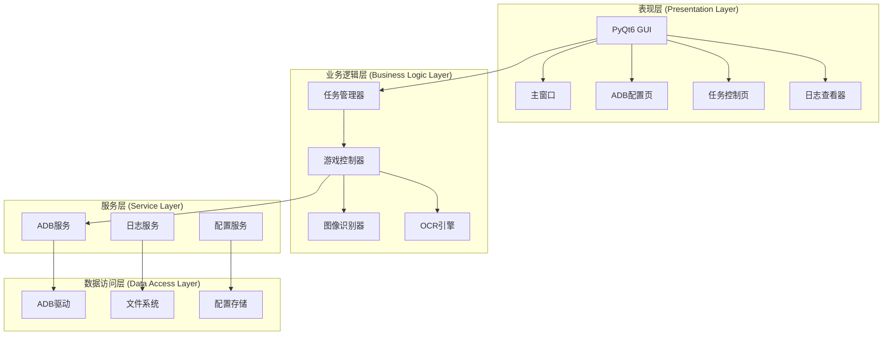

# 剑与远征启程自动化脚本 - Design Document

## Overview

本设计文档描述了剑与远征启程自动化脚本的技术架构和实现方案。系统采用分层架构设计，通过PyQt6构建图形界面，使用ADB（Android Debug Bridge）与Android设备通信，并集成图像识别和OCR技术实现游戏自动化操作。

### 核心设计原则
- **模块化设计**：各功能模块独立开发，便于维护和扩展
- **异步处理**：ADB操作和图像识别采用异步执行，避免界面卡顿
- **错误恢复**：完善的异常处理机制，确保脚本稳定运行
- **可配置性**：支持配置文件管理，用户设置持久化

### 技术栈
- **前端框架**：PyQt6 - 提供跨平台GUI支持
- **设备通信**：python-adb / adb-shell - ADB命令封装
- **图像识别**：OpenCV + PIL - 图像处理和模板匹配
- **OCR识别**：pytesseract / PaddleOCR - 文字识别
- **配置管理**：JSON / YAML - 配置文件存储
- **日志系统**：Python logging - 日志记录和管理

## Architecture

### 系统架构图



### 分层架构说明

1. **表现层**：负责用户界面展示和交互
2. **业务逻辑层**：实现核心业务功能，包括任务调度、游戏控制、图像识别等
3. **服务层**：提供基础服务支持，如ADB通信、配置管理、日志记录
4. **数据访问层**：处理底层数据存储和设备通信

## Components and Interfaces

### 1. ADB服务模块 (adb_service.py)

```python
class ADBService:
    """ADB服务接口，封装所有ADB操作"""
    
    def connect_device(self, device_id: str = None) -> bool:
        """连接设备（USB或无线）"""
        
    def disconnect_device(self) -> None:
        """断开设备连接"""
        
    def get_devices(self) -> List[Device]:
        """获取已连接设备列表"""
        
    def execute_command(self, command: str) -> str:
        """执行ADB命令"""
        
    def start_app(self, package_name: str) -> bool:
        """启动应用"""
        
    def stop_app(self, package_name: str) -> bool:
        """停止应用"""
        
    def tap(self, x: int, y: int) -> None:
        """点击坐标"""
        
    def swipe(self, x1: int, y1: int, x2: int, y2: int, duration: int = 500) -> None:
        """滑动操作"""
        
    def screenshot(self) -> Image:
        """截取屏幕"""
        
    def unlock_screen(self) -> bool:
        """解锁屏幕"""
```

### 2. 图像识别模块 (image_recognizer.py)

```python
class ImageRecognizer:
    """图像识别服务，用于游戏画面识别"""
    
    def __init__(self, template_path: str):
        """初始化，加载模板图像"""
        
    def find_image(self, screenshot: Image, template: str, threshold: float = 0.8) -> Optional[Tuple[int, int]]:
        """在截图中查找模板图像"""
        
    def find_all_images(self, screenshot: Image, template: str, threshold: float = 0.8) -> List[Tuple[int, int]]:
        """查找所有匹配的图像位置"""
        
    def wait_for_image(self, template: str, timeout: int = 30) -> bool:
        """等待图像出现"""
        
    def image_exists(self, template: str) -> bool:
        """检查图像是否存在"""
```

### 3. OCR识别模块 (ocr_engine.py)

```python
class OCREngine:
    """OCR文字识别引擎"""
    
    def __init__(self, lang: str = 'chi_sim'):
        """初始化OCR引擎"""
        
    def recognize_text(self, image: Image, region: Tuple[int, int, int, int] = None) -> str:
        """识别图像中的文字"""
        
    def find_text(self, text: str, screenshot: Image) -> Optional[Tuple[int, int]]:
        """在截图中查找指定文字的位置"""
        
    def get_all_text(self, screenshot: Image) -> List[Dict[str, Any]]:
        """获取截图中所有文字及其位置"""
```

### 4. 游戏控制器 (game_controller.py)

```python
class GameController:
    """游戏控制核心类"""
    
    def __init__(self, adb_service: ADBService):
        """初始化游戏控制器"""
        
    def wake_up_game(self) -> bool:
        """唤醒游戏应用"""
        
    def check_game_status(self) -> GameStatus:
        """检查游戏状态"""
        
    def navigate_to_main_menu(self) -> bool:
        """导航到主菜单"""
        
    def perform_daily_tasks(self) -> None:
        """执行日常任务"""
        
    def handle_popup(self) -> None:
        """处理弹窗"""
```

### 5. 任务管理器 (task_manager.py)

```python
class Task(ABC):
    """任务基类"""
    
    @abstractmethod
    def execute(self) -> bool:
        """执行任务"""
        
    @abstractmethod
    def pause(self) -> None:
        """暂停任务"""
        
    @abstractmethod
    def resume(self) -> None:
        """恢复任务"""
        
    @abstractmethod
    def stop(self) -> None:
        """停止任务"""

class TaskManager:
    """任务管理器"""
    
    def add_task(self, task: Task) -> None:
        """添加任务"""
        
    def remove_task(self, task_id: str) -> None:
        """移除任务"""
        
    def execute_tasks(self, mode: str = 'serial') -> None:
        """执行任务（串行或并行）"""
        
    def get_task_status(self, task_id: str) -> TaskStatus:
        """获取任务状态"""
```

### 6. GUI主窗口 (main_window.py)

```python
class MainWindow(QMainWindow):
    """主窗口类"""
    
    def __init__(self):
        """初始化主窗口"""
        
    def setup_ui(self) -> None:
        """设置UI界面"""
        
    def create_menu_bar(self) -> None:
        """创建菜单栏"""
        
    def create_tabs(self) -> None:
        """创建标签页"""
        
    def create_log_viewer(self) -> None:
        """创建日志查看器"""
        
    def on_wake_up_clicked(self) -> None:
        """唤醒应用按钮点击事件"""
```

## Data Models

### 1. 设备信息模型

```python
@dataclass
class Device:
    """设备信息"""
    device_id: str          # 设备ID
    device_name: str        # 设备名称
    device_model: str       # 设备型号
    android_version: str    # Android版本
    screen_resolution: Tuple[int, int]  # 屏幕分辨率
    connection_type: str    # 连接类型：USB/WIFI
    status: str            # 状态：connected/disconnected
```

### 2. 任务状态模型

```python
class TaskStatus(Enum):
    """任务状态枚举"""
    PENDING = "pending"        # 待执行
    RUNNING = "running"        # 执行中
    PAUSED = "paused"         # 已暂停
    COMPLETED = "completed"    # 已完成
    FAILED = "failed"         # 失败
    CANCELLED = "cancelled"    # 已取消

@dataclass
class TaskInfo:
    """任务信息"""
    task_id: str
    task_name: str
    task_type: str
    status: TaskStatus
    start_time: Optional[datetime]
    end_time: Optional[datetime]
    retry_count: int
    error_message: Optional[str]
```

### 3. 配置数据模型

```python
@dataclass
class ADBConfig:
    """ADB配置"""
    adb_path: str = "adb"              # ADB可执行文件路径
    device_id: Optional[str] = None    # 默认设备ID
    wireless_address: Optional[str] = None  # 无线连接地址
    screenshot_quality: int = 90       # 截图质量
    command_timeout: int = 30          # 命令超时时间（秒）

@dataclass
class GameConfig:
    """游戏配置"""
    package_name: str = "com.lilith.odyssey.cn"  # 游戏包名
    activity_name: str = ".MainActivity"          # 主活动名
    startup_wait_time: int = 10                  # 启动等待时间
    operation_delay: float = 0.5                 # 操作延迟

@dataclass
class AppConfig:
    """应用配置"""
    adb: ADBConfig
    game: GameConfig
    log_level: str = "INFO"
    auto_save: bool = True
    language: str = "zh_CN"
```

### 4. 游戏状态模型

```python
class GameStatus(Enum):
    """游戏状态"""
    NOT_RUNNING = "not_running"    # 未运行
    LOADING = "loading"            # 加载中
    MAIN_MENU = "main_menu"        # 主菜单
    IN_BATTLE = "in_battle"        # 战斗中
    IN_DIALOGUE = "in_dialogue"    # 对话中
    UNKNOWN = "unknown"            # 未知状态
```

## Error Handling

### 错误处理策略

1. **分层错误处理**
   - 每层捕获并处理本层相关的异常
   - 向上层抛出业务相关的自定义异常
   - 底层技术异常转换为业务异常

2. **异常类型定义**

```python
class AFK2AutoException(Exception):
    """基础异常类"""
    pass

class ADBConnectionError(AFK2AutoException):
    """ADB连接异常"""
    pass

class DeviceNotFoundError(AFK2AutoException):
    """设备未找到异常"""
    pass

class GameNotRunningError(AFK2AutoException):
    """游戏未运行异常"""
    pass

class ImageNotFoundError(AFK2AutoException):
    """图像未找到异常"""
    pass

class OCRRecognitionError(AFK2AutoException):
    """OCR识别异常"""
    pass

class TaskExecutionError(AFK2AutoException):
    """任务执行异常"""
    pass
```

3. **错误恢复机制**

```python
class RetryDecorator:
    """重试装饰器"""
    
    @staticmethod
    def retry(max_attempts: int = 3, delay: float = 1.0, exceptions: Tuple = (Exception,)):
        """
        重试装饰器
        :param max_attempts: 最大重试次数
        :param delay: 重试延迟（秒）
        :param exceptions: 需要重试的异常类型
        """
        def decorator(func):
            def wrapper(*args, **kwargs):
                for attempt in range(max_attempts):
                    try:
                        return func(*args, **kwargs)
                    except exceptions as e:
                        if attempt == max_attempts - 1:
                            raise
                        time.sleep(delay)
                        logger.warning(f"Retry {attempt + 1}/{max_attempts}: {str(e)}")
            return wrapper
        return decorator
```

4. **错误日志记录**

```python
import logging
import traceback

def setup_logger():
    """配置日志系统"""
    logger = logging.getLogger('AFK2Auto')
    logger.setLevel(logging.DEBUG)
    
    # 文件处理器
    file_handler = logging.FileHandler('afk2_auto.log', encoding='utf-8')
    file_handler.setLevel(logging.DEBUG)
    
    # 控制台处理器
    console_handler = logging.StreamHandler()
    console_handler.setLevel(logging.INFO)
    
    # 格式化器
    formatter = logging.Formatter(
        '%(asctime)s - %(name)s - %(levelname)s - %(message)s'
    )
    
    file_handler.setFormatter(formatter)
    console_handler.setFormatter(formatter)
    
    logger.addHandler(file_handler)
    logger.addHandler(console_handler)
    
    return logger
```

5. **用户友好的错误提示**

```python
ERROR_MESSAGES = {
    ADBConnectionError: "无法连接到设备，请检查ADB连接和设备授权",
    DeviceNotFoundError: "未找到设备，请确保设备已连接并开启USB调试",
    GameNotRunningError: "游戏未运行，请先启动游戏",
    ImageNotFoundError: "未找到目标图像，可能游戏界面已变化",
    OCRRecognitionError: "文字识别失败，请检查截图质量",
    TaskExecutionError: "任务执行失败，请查看日志了解详情"
}

def get_user_friendly_message(exception: Exception) -> str:
    """获取用户友好的错误信息"""
    for exc_type, message in ERROR_MESSAGES.items():
        if isinstance(exception, exc_type):
            return message
    return f"发生未知错误：{str(exception)}"
```

## Testing Strategy

### 1. 单元测试

**测试框架**：pytest

**测试范围**：
- ADB命令封装的正确性
- 图像识别算法的准确性
- OCR识别的准确率
- 配置文件的读写
- 任务状态管理

**示例测试**：

```python
# test_adb_service.py
import pytest
from unittest.mock import Mock, patch
from src.services.adb_service import ADBService

class TestADBService:
    @pytest.fixture
    def adb_service(self):
        return ADBService()
    
    def test_connect_device_success(self, adb_service):
        with patch('subprocess.run') as mock_run:
            mock_run.return_value.returncode = 0
            assert adb_service.connect_device("emulator-5554") == True
    
    def test_tap_command(self, adb_service):
        with patch.object(adb_service, 'execute_command') as mock_exec:
            adb_service.tap(100, 200)
            mock_exec.assert_called_with("shell input tap 100 200")
```

### 2. 集成测试

**测试内容**：
- ADB服务与实际设备的连接
- 完整的游戏唤醒流程
- 图像识别与点击操作的配合
- 任务的完整执行流程

```python
# test_integration.py
@pytest.mark.integration
class TestGameIntegration:
    def test_wake_up_game_flow(self, real_device):
        """测试完整的游戏唤醒流程"""
        controller = GameController(real_device)
        
        # 解锁屏幕
        assert controller.unlock_screen()
        
        # 启动游戏
        assert controller.wake_up_game()
        
        # 等待主界面
        assert controller.wait_for_main_menu(timeout=30)
```

### 3. GUI测试

**测试框架**：pytest-qt

```python
# test_gui.py
import pytest
from PyQt6.QtCore import Qt
from src.gui.main_window import MainWindow

@pytest.fixture
def main_window(qtbot):
    window = MainWindow()
    qtbot.addWidget(window)
    return window

def test_wake_up_button(main_window, qtbot):
    """测试唤醒按钮"""
    button = main_window.wake_up_button
    qtbot.mouseClick(button, Qt.MouseButton.LeftButton)
    assert main_window.status_label.text() == "正在唤醒游戏..."
```

### 4. 性能测试

```python
# test_performance.py
import time
import pytest
from src.services.adb_service import ADBService

@pytest.mark.performance
def test_screenshot_performance():
    """测试截图性能"""
    adb = ADBService()
    start_time = time.time()
    
    for _ in range(10):
        adb.screenshot()
    
    elapsed = time.time() - start_time
    avg_time = elapsed / 10
    
    assert avg_time < 0.5, f"截图平均耗时 {avg_time:.2f}秒，超过预期"
```

### 5. 测试数据准备

```
tests/
├── fixtures/
│   ├── screenshots/       # 测试用截图
│   ├── templates/        # 测试用模板图像
│   └── configs/          # 测试配置文件
├── unit/                 # 单元测试
├── integration/          # 集成测试
└── performance/          # 性能测试
```

### 6. 持续集成配置

```yaml
# .github/workflows/test.yml
name: Tests

on: [push, pull_request]

jobs:
  test:
    runs-on: windows-latest
    
    steps:
    - uses: actions/checkout@v2
    
    - name: Set up Python
      uses: actions/setup-python@v2
      with:
        python-version: '3.8'
    
    - name: Install dependencies
      run: |
        pip install -r requirements.txt
        pip install -r requirements-dev.txt
    
    - name: Run tests
      run: |
        pytest tests/unit -v
        pytest tests/integration -v -m "not requires_device"
    
    - name: Generate coverage report
      run: |
        pytest --cov=src --cov-report=xml
    
    - name: Upload coverage
      uses: codecov/codecov-action@v2
```

## 项目结构

```
afk2-auto-script/
├── src/
│   ├── __init__.py
│   ├── main.py                 # 程序入口
│   ├── services/               # 服务层
│   │   ├── __init__.py
│   │   ├── adb_service.py     # ADB服务
│   │   ├── config_service.py  # 配置服务
│   │   └── log_service.py     # 日志服务
│   ├── controllers/            # 控制器层
│   │   ├── __init__.py
│   │   ├── game_controller.py # 游戏控制器
│   │   └── task_manager.py    # 任务管理器
│   ├── recognition/            # 识别模块
│   │   ├── __init__.py
│   │   ├── image_recognizer.py # 图像识别
│   │   └── ocr_engine.py      # OCR引擎
│   ├── gui/                    # GUI模块
│   │   ├── __init__.py
│   │   ├── main_window.py     # 主窗口
│   │   ├── adb_config_tab.py  # ADB配置页
│   │   ├── task_tab.py        # 任务页
│   │   └── log_viewer.py      # 日志查看器
│   ├── models/                 # 数据模型
│   │   ├── __init__.py
│   │   ├── device.py          # 设备模型
│   │   ├── task.py            # 任务模型
│   │   └── config.py          # 配置模型
│   ├── utils/                  # 工具类
│   │   ├── __init__.py
│   │   ├── retry.py           # 重试机制
│   │   └── exceptions.py      # 异常定义
│   └── resources/              # 资源文件
│       ├── templates/          # 图像模板
│       └── configs/            # 配置文件
├── tests/                      # 测试目录
├── docs/                       # 文档目录
├── requirements.txt            # 依赖列表
├── requirements-dev.txt        # 开发依赖
├── setup.py                    # 安装脚本
├── README.md                   # 项目说明
└── run.py                      # 启动脚本
```

## 下一步计划

1. **第一阶段**：实现基础框架
   - 搭建项目结构
   - 实现ADB服务封装
   - 创建基础GUI界面

2. **第二阶段**：核心功能开发
   - 实现游戏唤醒功能
   - 集成图像识别
   - 添加OCR支持

3. **第三阶段**：功能完善
   - 添加任务管理系统
   - 实现配置持久化
   - 完善错误处理

4. **第四阶段**：测试与优化
   - 编写测试用例
   - 性能优化
   - 用户体验改进
